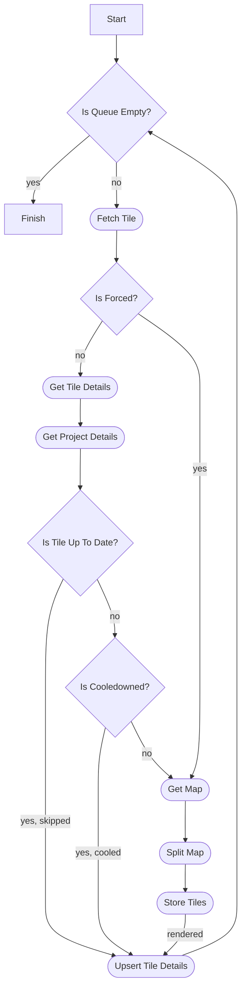

# Retiler


----------------------------------
Tiles for rendering will be consumed from a job queue, currently using [pgboss](https://github.com/timgit/pg-boss).

Each tile holds a `metatile` value and `ZXY` postition. typically a consumed tile will be a square metatile of 8x8 normal tiles (64 tiles), meaning covering a square area of 2048x2048 pixels.

The initial metatile image will be requested for rendering from a map provider service (wms or arcgis), for instance on arcgis, by using the [export map operation](http://sampleserver1.arcgisonline.com/arcgis/sdk/rest/export.html), the request of a large area for rendering e.g. 2048x2048 pixels is more efficient than 64 requests of 256x256.

The fetched metatile image will be splitted into 256x256 pixels tiles in a PNG format and finally will be stored on s3 storage.

## How it works


## config
`app.queueName`: the job queue name to consume tiles from

`app.jobQueue.noSupervisor`: flag for maintenance and monitoring operations on the job queue. defaults to true (meaning no supervision)

`app.map.provider`: the map provider type, wms or arcgis

`app.map.url`: the url of the map provider service to fetch the map from

`app.map.client.timeoutMs`: the timeout in ms for a fetch map request. defaults to 60000

`app.map.wms.version`: wms service version, 1.1.1 or 1.3.0

`app.map.wms.layers`: layers to display on map, a comma-separated list of layer names

`app.map.wms.styles`: styles in which layers are to be rendered, a comma-separated list of style names

`app.tilesStorage.providers`: an array of tile storage destinations of type `s3` or `fs`, schema is the following:
- for `s3` type:
```json
{
    "type": "s3",
    "endpoint": "s3-endpoint",
    "bucketName": "s3-bucket-name",
    "region": "s3-region",
    "forcePathStyle": "boolean flag",
    "credentials": {
        "accessKeyId": "s3 access-key-id",
        "secretAccessKey": "s3 secret-access-key"
    }
}
```

- for `fs` type:
```json
{
    "type": "fs",
    "basePath": "local tile storage destination path"
}
```

`app.tilesStorage.layout.format`: the format of the tile's key in the storage bucket, the z, x, y values of the tile can be retrieved to the key. defaults to `prefix/{z}/{x}/{y}.png`
e.g. `prefix/{z}/{x}/{y}.png` formated to the tile
```json
{ z: 3, x: 10, y: 4 }
```
will result in the key: "prefix/3/10/4.png"

`app.tilesStorage.layout.shouldFlipY`: determine if the key value of y (formatted by `app.tilesStorage.layout.format`) should be flipped over the y axis. e.g. if on the y axis there are overall 8 tiles with y values of 0 through 7 then 0 will be flipped to 7 and 7 to 0, 1 to 6 and 6 to 1 and so on. defaults to true

## Run Locally

Clone the project

```bash

git clone https://github.com/MapColonies/retiler.git

```

Go to the project directory

```bash

cd retiler

```

Install dependencies

```bash

npm install

```

Start the server

```bash

npm start

```

## Running Tests

To run tests, run the following command

```bash

npm run test

```

To only run unit tests:
```bash
npm run test:unit
```

To only run integration tests:
```bash
npm run test:integration
```
